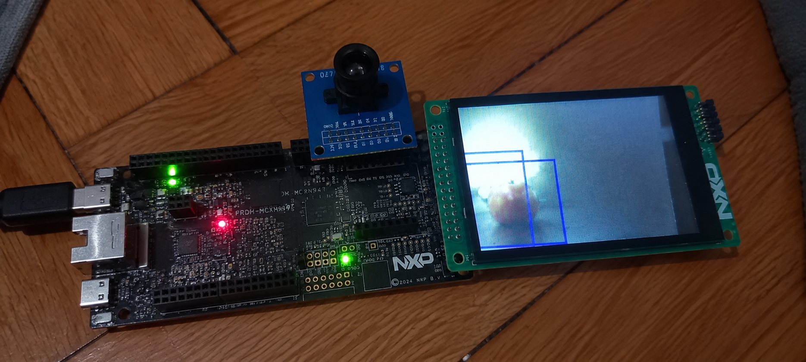
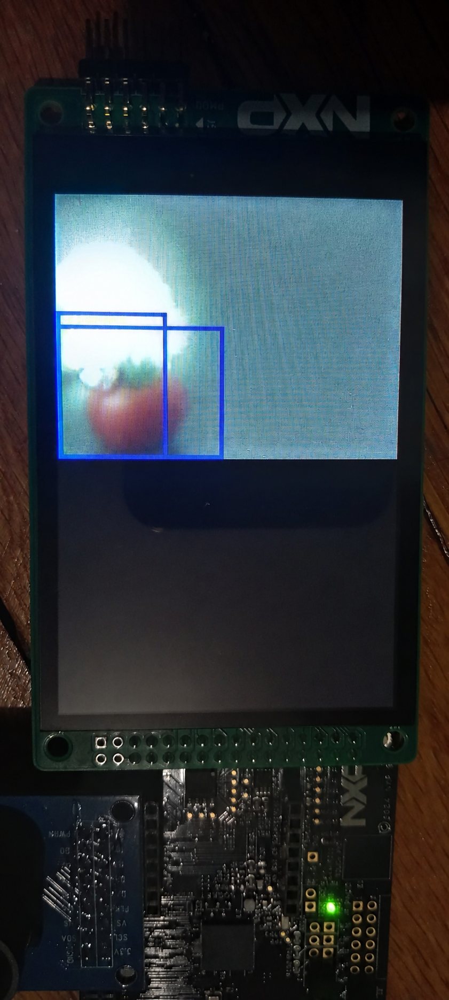

# Edge AI Fruit Detection on NXP FRDM-MCXN947

<table>
  <tr>
    <td align="center">
      
    </td>
    <td align="center">
      
    </td>
  </tr>
</table>

Real-time embedded fruit detection using an OV7670 camera, NanoDet-m, TensorFlow Lite Micro and the NXP MCXN947 Neutron NPU.

This project implements a complete Edge AI computer vision pipeline running directly on an NXP FRDM-MCXN947 development board. The system captures images from an OV7670 camera, processes them locally, runs a lightweight NanoDet-m object detection model using the NXP Neutron acceleration infrastructure, decodes the neural network output and displays the detected objects directly over the camera image on an ST7796S LCD.

The current model detects three classes: Apple, Cherry and Tomato.

The complete processing chain is:

```text
OV7670 Camera
      |
      v
320x240 RGB565 Frame
      |
      v
Image Preprocessing
      |
      v
96x96x3 INT8 Tensor
      |
      v
NanoDet-m
      |
      v
NXP Neutron
      |
      v
Quantized Model Output
      |
      v
NanoDet Decoder
      |
      v
NMS
      |
      v
Bounding Boxes
      |
      v
RGB565 Overlay
      |
      v
ST7796S LCD
```

## Table of Contents

- [Project Overview](#project-overview)
- [Main Objectives](#main-objectives)
- [System Architecture](#system-architecture)
- [Hardware](#hardware)
- [Software Stack](#software-stack)
- [Complete Data Flow](#complete-data-flow)
- [Camera Capture](#camera-capture)
- [Image Representation](#image-representation)
- [Image Preprocessing](#image-preprocessing)
- [NanoDet-m Model](#nanodet-m-model)
- [NanoDet Output](#nanodet-output)
- [Output Quantization](#output-quantization)
- [NanoDet Decoder](#nanodet-decoder)
- [Distribution Focal Loss](#distribution-focal-loss)
- [Bounding Box Generation](#bounding-box-generation)
- [Non-Maximum Suppression](#non-maximum-suppression)
- [NXP Neutron Acceleration](#nxp-neutron-acceleration)
- [TensorFlow Lite Micro](#tensorflow-lite-micro)
- [FreeRTOS Architecture](#freertos-architecture)
- [Double Buffering](#double-buffering)
- [Detection Overlay](#detection-overlay)
- [Memory Usage](#memory-usage)
- [Training Pipeline](#training-pipeline)
- [Dataset](#dataset)
- [Model Conversion](#model-conversion)
- [Project Structure](#project-structure)
- [Source Code](#source-code)
- [Configuration](#configuration)
- [Building the Project](#building-the-project)
- [Flashing and Running](#flashing-and-running)
- [Serial Debug Output](#serial-debug-output)
- [Development and Debugging](#development-and-debugging)
- [Current Limitations](#current-limitations)
- [Possible Improvements](#possible-improvements)
- [Troubleshooting](#troubleshooting)
- [Technical Summary](#technical-summary)
- [Conclusion](#conclusion)
- [License](#license)

# Project Overview

The purpose of this project is to demonstrate how a complete object detection application can be deployed on an embedded platform with limited memory and computational resources.

A typical computer vision system would capture an image, transfer it to a computer, run a neural network using a CPU or GPU and then display the result. This project instead keeps the complete inference pipeline on the embedded platform.

The board receives the image from the OV7670 camera, prepares the neural network input, executes NanoDet-m, processes the model output and renders the detections back onto the original image.

The system therefore has two related paths:

```text
                         +--------------------+
                         |    OV7670 Camera   |
                         +---------+----------+
                                   |
                                   v
                           320x240 RGB565
                                   |
                         +---------+---------+
                         |                   |
                         v                   v
                  Display Path        Inference Path
                         |                   |
                         v                   v
                       LCD          RGB565 -> RGB888
                                             |
                                             v
                                      Resize to 96x96
                                             |
                                             v
                                      INT8 Quantization
                                             |
                                             v
                                        NanoDet-m
                                             |
                                             v
                                       Neutron NPU
                                             |
                                             v
                                       Output Tensor
                                             |
                                             v
                                     NanoDet Decoder
                                             |
                                             v
                                            NMS
                                             |
                                             v
                                       Detections
                                             |
                         +-------------------+
                         |
                         v
                  Bounding Box Overlay
                         |
                         v
                       LCD
```

The project is built around the actual constraints of embedded AI: limited RAM, fixed memory regions, model quantization, DMA transfers, task scheduling and accelerator compatibility.

# Main Objectives

The main objectives are:

- Capture real images from an OV7670 camera.
- Process the camera image directly on the MCXN947.
- Run NanoDet-m using a 96x96 input.
- Use INT8 quantization to reduce tensor memory requirements.
- Use the NXP Neutron acceleration infrastructure.
- Decode NanoDet output directly on the MCU.
- Apply Non-Maximum Suppression locally.
- Draw detections over the original camera image.
- Display the final result on an ST7796S LCD.
- Use FreeRTOS to separate camera processing and inference.
- Manage inference buffers explicitly through FreeRTOS queues.
- Keep the implementation suitable for a resource-constrained embedded platform.

# System Architecture

The application is divided into two main FreeRTOS tasks: `CameraTask` and `InferenceTask`.

```text
                    FreeRTOS
                       |
             +---------+---------+
             |                   |
             v                   v
       Camera Task         Inference Task
             |                   |
       Capture frame        Get input buffer
             |                   |
       Draw detections      Copy input tensor
             |                   |
       Display frame        Run inference
             |                   |
       Preprocess image     Decode output
             |                   |
             v                   v
       Ready Queue  ------> Detection State
             |                   |
             +-------------------+
                         |
                         v
                    Free Queue
```

The camera task obtains a free inference buffer, waits for a complete camera frame, draws the latest available detections, displays the frame, preprocesses it and sends the prepared buffer to the ready queue.

The inference task receives a prepared buffer, copies the data into the TensorFlow Lite Micro input tensor, runs the blocking model invocation, decodes the output and returns the buffer to the free queue.

The two tasks therefore communicate through explicit buffer ownership instead of sharing one input buffer at the same time.

# Hardware

## NXP FRDM-MCXN947

The FRDM-MCXN947 is the main embedded processing platform. The application uses its Cortex-M33 environment together with SmartDMA, FlexIO, I2C, LCD support and the NXP Neutron AI acceleration infrastructure.

## OV7670 Camera

The OV7670 is configured through I2C and currently operates at:

```text
Resolution: 320 x 240
Pixel format: RGB565
```

During initialization the application configures the camera interface, reads the sensor identification register and writes the selected register configuration. The expected sensor ID is `0x76`.

Camera configuration is implemented in `ov7670_demo.c` and `ov7670_demo.h`.

## ST7796S LCD

The camera image is displayed on an ST7796S LCD through the FlexIO MCU LCD interface. Bounding boxes are drawn directly into the RGB565 camera frame before the frame is transferred to the display.

# Software Stack

The project uses:

```text
C / C++
FreeRTOS
TensorFlow Lite Micro
NXP Neutron
MCUXpresso SDK
NanoDet-m
CMake
ARM GNU Embedded Toolchain
```

The main embedded components are the OV7670 camera driver, SmartDMA capture, ST7796S LCD driver, RGB565 preprocessing, TensorFlow Lite Micro, the Neutron custom operator, NanoDet post-processing and FreeRTOS tasks and queues.

# Complete Data Flow

A complete frame follows this path:

```text
OV7670
  |
  | 320x240 RGB565
  v
Camera Frame Buffer
  |
  +----------------------+
  |                      |
  v                      v
LCD Display          Preprocessing
                          |
                          v
                     RGB565 -> RGB888
                          |
                          v
                      96x96 Resize
                          |
                          v
                     INT8 Conversion
                          |
                          v
                    TFLM Input Tensor
                          |
                          v
                       NanoDet-m
                          |
                          v
                      Neutron NPU
                          |
                          v
                     Output Tensor
                          |
                          v
                    Dequantization
                          |
                          v
                    DFL Decoding
                          |
                          v
                    Bounding Boxes
                          |
                          v
                         NMS
                          |
                          v
                      Detections
                          |
                          v
                Map 96x96 -> 320x240
                          |
                          v
                   RGB565 Overlay
                          |
                          v
                         LCD
```

# Camera Capture

The camera produces a complete QVGA frame:

```text
Width  = 320
Height = 240
```

RGB565 uses two bytes per pixel, so a complete frame requires:

```text
320 x 240 x 2 = 153600 bytes
```

The complete frame is captured using SmartDMA. The SmartDMA configuration writes incoming camera data directly into the camera frame buffer.

The current capture path uses a whole-frame operation:

```c
SMARTDMA_Boot(kSMARTDMA_CameraWholeFrameQVGA, &s_smartdma_param, 0x2U);
```

The camera module exposes the existing capture interface through functions such as `CAMERA_Init()`, `CAMERA_WaitForStripe()` and `CAMERA_ReleaseStripe()`. The historical stripe naming is retained even though the current configuration captures a complete QVGA frame.

# Image Representation

RGB565 stores the channels using 5 bits for red, 6 bits for green and 5 bits for blue:

```text
RRRRRGGGGGGBBBBB
```

The LCD can use RGB565 directly, but NanoDet expects a three-channel input. The preprocessing path therefore converts the camera representation into RGB values before quantization.

```text
RGB565
   |
   v
RGB888
   |
   v
Normalization
   |
   v
INT8 Quantization
```

# Image Preprocessing

NanoDet receives a `96 x 96 x 3` input tensor:

```text
96 x 96 x 3 = 27648 values
```

With INT8 values this is `27648 bytes`.

The preprocessing implementation is located in `image_preprocess.c` and `image_preprocess.h`. The main conversion function is `RGB565_ResizeToINT8()`.

The function performs RGB565 unpacking, resizing/sampling, channel normalization and INT8 conversion.

The current preprocessing constants are:

```c
#define INPUT_ZERO_POINT (-14)
#define R_INV_STD_SCALE_Q16 61325
#define G_INV_STD_SCALE_Q16 61397
#define B_INV_STD_SCALE_Q16 60184
#define R_MEAN_Q16 ((int32_t)(103.53f * 65536.0f))
#define G_MEAN_Q16 ((int32_t)(116.28f * 65536.0f))
#define B_MEAN_Q16 ((int32_t)(123.675f * 65536.0f))
```

Fixed-point arithmetic is used for the main per-pixel normalization path to avoid unnecessary floating-point work for every input value.

# NanoDet-m Model

The project uses a lightweight NanoDet-m 0.5x model trained for three classes:

```text
Apple
Cherry
Tomato
```

The model input is:

```text
1 x 96 x 96 x 3
```

or `27648` values.

The small input resolution is intentional. Increasing the input size would also increase input memory, activation memory, computational work and potentially tensor arena requirements.

The embedded model is represented by the generated header:

```text
nanodet_m_0.5x_fruits_neutron.h
```

# NanoDet Output

The current model produces:

```text
1 x 189 x 35
```

The output contains:

```text
189 x 35 = 6615 values
```

The 189 prediction points come from three feature-map levels:

```text
12 x 12 = 144
6 x 6   = 36
3 x 3   = 9
```

Therefore:

```text
144 + 36 + 9 = 189
```

The corresponding strides are `8`, `16` and `32`.

Each prediction contains 35 values:

```text
3 class scores
+
32 box-regression values
=
35 values
```

The 32 regression values are:

```text
4 box sides x 8 DFL bins = 32
```

# Output Quantization

The current model output reports approximately:

```text
Scale      = 0.059257
Zero point = 65
```

The decoder converts quantized values using:

```text
real_value = scale * (quantized_value - zero_point)
```

The resulting real-valued data is then used by the NanoDet post-processing implementation.

# NanoDet Decoder

The decoder is implemented in `nanodet_decoder.cpp` and `nanodet_decoder.h`.

Its responsibilities are:

- output dequantization
- class score extraction
- DFL decoding
- bounding box reconstruction
- coordinate clamping
- score filtering
- IoU calculation
- Non-Maximum Suppression
- final detection generation

The processing chain is:

```text
Raw Output
    |
    v
Dequantization
    |
    v
Class Scores
    |
    v
DFL Regression
    |
    v
Bounding Box
    |
    v
Score Filtering
    |
    v
NMS
    |
    v
Final Detections
```

The current decoder configuration is:

```text
Classes:             3
DFL bins:            8
Score threshold:     0.05
NMS IoU threshold:   0.60
Maximum box width:   90% of model width
Maximum box height:  90% of model height
```

# Distribution Focal Loss

NanoDet represents each bounding-box side as a distribution over discrete bins instead of directly predicting one scalar value.

The project uses 8 bins for each side:

```text
left
 top
right
bottom
```

This produces:

```text
4 x 8 = 32 regression values
```

for every prediction point.

The decoder calculates a continuous distance from the distribution, then applies the corresponding feature-map stride to obtain coordinates in the model coordinate system.

# Bounding Box Generation

The three feature-map levels are:

```text
12 x 12, stride 8
6 x 6,   stride 16
3 x 3,   stride 32
```

For each prediction point, the decoder determines its center and reconstructs the four box sides from the decoded distances.

The resulting coordinates are clamped to the model input range:

```text
0..96
```

The boxes are later mapped from the model coordinate system to the original 320x240 camera coordinate system.

# Non-Maximum Suppression

The neural network can generate several overlapping predictions for the same object. Non-Maximum Suppression removes sufficiently overlapping lower-scoring candidates.

The project uses an IoU threshold of:

```text
0.60
```

IoU is calculated as:

```text
IoU = Intersection Area / Union Area
```

Candidates are filtered by score first, then overlapping detections are processed by the NMS stage.

# NXP Neutron Acceleration

The MCXN947 provides the Neutron AI acceleration infrastructure used by the converted model.

The NanoDet model contains the custom TensorFlow Lite Micro operator:

```text
NEUTRON_GRAPH
```

The operation resolver registers the model's required built-in operators, including:

```text
Pad
Conv2D
LeakyReLU
DepthwiseConv2D
Concatenation
Reshape
Transpose
Slice
ResizeBilinear
Add
Logistic
Quantize
```

and the custom `NEUTRON_GRAPH` operator.

This allows TensorFlow Lite Micro to execute the converted model using the Neutron infrastructure.

# TensorFlow Lite Micro

TensorFlow Lite Micro is the embedded inference runtime.

It is responsible for loading the embedded model, creating the interpreter, allocating tensors, providing the model input, invoking the network and exposing the output tensor.

The model is compiled into the firmware through `nanodet_m_0.5x_fruits_neutron.h`.

# Tensor Arena

TensorFlow Lite Micro requires a statically allocated tensor arena.

The current model configuration allocates approximately:

```text
146 KB
```

The runtime currently reports approximately:

```text
149428 bytes
```

of tensor arena usage.

The arena contains interpreter data and intermediate tensors required during inference. Because the target is an MCU, the arena cannot grow dynamically in the same way a desktop application can allocate additional memory when required.

# FreeRTOS Architecture

FreeRTOS is used to separate camera processing from inference.

The application currently has two main tasks:

```text
CameraTask
InferenceTask
```

Both currently use priority 3.

## Camera Task

The camera task obtains a free inference buffer, waits for a camera frame, draws the latest detections, displays the frame, preprocesses the image and sends the prepared tensor to the ready queue.

```text
Get free buffer
      |
      v
Wait for frame
      |
      v
Draw detections
      |
      v
Display frame
      |
      v
Preprocess
      |
      v
Ready queue
```

## Inference Task

The inference task receives the prepared buffer, copies it into the model input, invokes the model, decodes detections, updates the shared detection state and returns the buffer to the free queue.

```text
Ready queue
      |
      v
Receive buffer
      |
      v
Copy model input
      |
      v
Invoke model
      |
      v
Decode detections
      |
      v
Update state
      |
      v
Free queue
```

`MODEL_RunInference()` is blocking in the current implementation. The inference task waits while the neural network executes.

# Double Buffering

Two statically allocated inference buffers are used.

Each buffer contains:

```text
96 x 96 x 3 = 27648 bytes
```

Two buffers therefore require:

```text
27648 x 2 = 55296 bytes
```

The buffers are exchanged through two FreeRTOS queues:

```text
s_free_queue
s_ready_queue
```

The ownership cycle is:

```text
FREE
 |
 v
CAMERA OWNS BUFFER
 |
 v
READY
 |
 v
INFERENCE OWNS BUFFER
 |
 v
FREE
```

This prevents the camera task from overwriting an input buffer while the inference task is still using it.

# Detection Overlay

The model operates in a 96x96 coordinate system while the camera image is 320x240.

After decoding, the bounding boxes are mapped to the camera coordinate system.

The boxes are then drawn directly into the RGB565 camera frame.

The current class colors are:

```text
Apple   -> 0xF800 (red)
Cherry  -> 0x07E0 (green)
Tomato  -> 0x001F (blue)
Unknown -> 0xFFFF (white)
```

The rectangle outline is four pixels thick.

The important part of this design is that there is no need for a second complete RGB565 camera-sized graphics buffer just to display the detections.

# Memory Usage

Memory is one of the main constraints of the project.

The major buffers include:

```text
Camera frame:
320 x 240 x 2 = 153600 bytes

Two inference buffers:
27648 x 2 = 55296 bytes

Tensor arena:
approximately 146 KB allocation
```

Additional memory is required by FreeRTOS, task stacks, queues, drivers, model data, LCD buffers and detection state.

Large objects are therefore explicitly placed into appropriate memory sections where required. The inference buffers, for example, use the `.sramx` section.

# Training Pipeline

The training environment is kept in the `training/` directory.

The general model development pipeline is:

```text
Dataset
   |
   v
Dataset Preparation
   |
   v
Object Detection Annotations
   |
   v
NanoDet Training
   |
   v
Validation
   |
   v
Model Export
   |
   v
TensorFlow Lite Conversion
   |
   v
Quantization
   |
   v
Neutron Conversion
   |
   v
Embedded Model Header
```

The embedded firmware does not require the full training dataset. It only needs the final deployable model and the code required to execute and decode it.

# Dataset

The target classes are:

```text
Apple
Cherry
Tomato
```

The training directory contains dataset structures used during model development, including training and validation data and object-detection-specific data.

Large datasets, generated checkpoints and other training artifacts are kept outside the final source-controlled firmware content where appropriate.

# Model Conversion

The trained model is converted into an embedded-compatible representation before being used by the firmware.

The overall conversion path is:

```text
NanoDet Model
     |
     v
Export
     |
     v
TensorFlow Lite
     |
     v
Quantization
     |
     v
Neutron Conversion
     |
     v
C/C++ Model Representation
     |
     v
Embedded Firmware
```

The final model used by the firmware is represented by:

```text
nanodet_m_0.5x_fruits_neutron.h
```

# Project Structure

A simplified repository structure is:

```text
Edge_AI/
|
+-- .vscode/
+-- debug/
+-- frdmmcxn947_cm33_core0/
+-- training/
+-- neutron/
+-- __repo__/
+|
+-- .gitmodules
+-- CMakeLists.txt
+-- CMakePresets.json
+-- Kconfig
+-- example.yml
+-- mcux_include.json
+-- prj.conf
+|
+-- main.c
+-- camera_stripe_capture.c
+-- camera_stripe_capture.h
+-- ov7670_demo.c
+-- ov7670_demo.h
+-- lcd_live.c
+-- lcd_live.h
+-- image_preprocess.c
+-- image_preprocess.h
+-- model.cpp
+-- model.h
+-- model_nanodet_ops_npu.cpp
+-- nanodet_decoder.cpp
+-- nanodet_decoder.h
+-- nanodet_m_0.5x_fruits_neutron.h
+-- MCXN947_cm33_core0_flash.ld
+-- readme.md
+```

Build output and external/generated resources are kept separate from the main source files where possible.

# Source Code

## `main.c`

Contains the main application, initialization, FreeRTOS queues, inference buffers, detection state and the `CameraTask` and `InferenceTask` implementations.

## `camera_stripe_capture.c/.h`

Handles the OV7670 frame capture path using SmartDMA. The current configuration captures a complete QVGA frame even though the existing API retains the historical stripe naming.

## `ov7670_demo.c/.h`

Contains OV7670 initialization, I2C configuration, sensor ID verification and register configuration.

## `lcd_live.c/.h`

Handles ST7796S LCD initialization and RGB565 frame/stripe transfers using the FlexIO MCU LCD driver.

## `image_preprocess.c/.h`

Converts RGB565 camera data into the 96x96 INT8 tensor expected by NanoDet.

## `model.cpp/.h`

Provides the TensorFlow Lite Micro model wrapper, tensor allocation, input access, inference invocation and detection access.

## `model_nanodet_ops_npu.cpp`

Registers the TensorFlow Lite Micro operators required by NanoDet and the custom `NEUTRON_GRAPH` operator.

## `nanodet_decoder.cpp/.h`

Implements output dequantization, class selection, DFL decoding, bounding box reconstruction, score filtering, IoU calculation and NMS.

# Configuration

The main configuration files are:

```text
CMakeLists.txt
CMakePresets.json
prj.conf
MCXN947_cm33_core0_flash.ld
```

The project enables the required camera, display, SmartDMA, TensorFlow Lite Micro, Neutron and FreeRTOS components.

The large inference buffers are statically allocated. This avoids relying on dynamic allocation for the main neural-network input storage.

# Building the Project

The project is intended to be built using the MCUXpresso/VS Code development environment and its configured CMake project.

The main build files are:

```text
CMakeLists.txt
CMakePresets.json
prj.conf
```

The target is the MCXN947 Cortex-M33 environment.

A typical workflow is:

```text
Open project
    |
    v
Configure CMake
    |
    v
Build
    |
    v
Generate firmware
    |
    v
Flash board
```

Generated build artifacts should not be committed to the repository.

# Flashing and Running

After building the project, flash the generated firmware to the FRDM-MCXN947 using the normal NXP debug/programming workflow.

After programming:

1. Connect the OV7670 camera.
2. Connect the ST7796S LCD.
3. Power the board.
4. Open the serial console.
5. Reset the board.
6. Wait for the initialization messages.
7. Verify that the camera image appears on the LCD.
8. Verify that the inference task starts processing buffers.
9. Check the detection output in the serial console.
10. Observe the bounding boxes on the LCD.

# Serial Debug Output

The project contains detailed debug output for development.

Typical model initialization output includes:

```text
NanoDet: AllocateTensors OK
NanoDet tensor arena: 149428 bytes
NanoDet input: bytes=27648
NanoDet input dims: 1x96x96x3
NanoDet: inputs=1
NanoDet: outputs=1
NanoDet output: bytes=6615
NanoDet output dims: 1x189x35
NanoDet output quantization: scale_x1e6=59257 zero_point=65
NanoDet output type=9
```

During inference the application can report:

```text
INFERENCE TASK: inference 1, buffer=0
INFERENCE: Invoke returned=0
NANODET: detections=3
```

Individual detections can be printed as:

```text
DET 0: Apple score_x1000=888 box=(0,0)-(95,96)
```

These messages make it possible to validate the camera, model, decoder and task pipeline without relying only on the LCD.

# Development and Debugging

The project was developed by debugging the system stage by stage rather than treating the entire pipeline as one component.

The main validation sequence is:

```text
Camera initialization
        |
        v
Camera frame capture
        |
        v
LCD display
        |
        v
Image preprocessing
        |
        v
Model initialization
        |
        v
Model invocation
        |
        v
Raw output
        |
        v
NanoDet decoding
        |
        v
NMS
        |
        v
Coordinate mapping
        |
        v
LCD overlay
```

This separation makes it easier to determine which component is responsible for a failure.

## Camera Debugging

If the camera does not initialize, check the I2C configuration, sensor ID, camera register configuration, clock configuration and camera wiring.

## Model Debugging

The model initialization output exposes input dimensions, output dimensions, tensor sizes, quantization parameters and tensor arena usage. These values are useful for verifying that the embedded model matches the preprocessing and decoder assumptions.

## FreeRTOS Debugging

The two main tasks currently use equal priority:

```c
#define CAMERA_TASK_PRIORITY 3U
#define INFERENCE_TASK_PRIORITY 3U
```

This is important because the camera task produces inference buffers while the inference task consumes them. The camera task also yields after submitting a prepared buffer so that the inference task gets execution time.

## Buffer Debugging

The two queues represent ownership:

```text
s_free_queue
s_ready_queue
```

A buffer should be in exactly one state at a time: free, owned by the camera task, ready for inference, or owned by the inference task.

# HardFault Debugging

The project contains a HardFault handler that captures processor state and the stacked execution context.

This is useful when diagnosing failures caused by:

- invalid memory access
- stack overflow
- incorrect memory placement
- DMA configuration problems
- tensor arena corruption
- buffer overruns
- invalid function pointers
- corrupted task state

For an embedded AI application, HardFault debugging is especially important because large tensors, DMA buffers, task stacks and model data all coexist in a constrained memory layout.

# Memory Debugging

The main memory consumers are:

```text
Camera frame:
153600 bytes

Two inference buffers:
55296 bytes

Tensor arena:
approximately 146 KB allocation
```

Additional memory is required by FreeRTOS, task stacks, queues, drivers, model data, LCD buffers and detection state.

This is why the project uses explicit memory sections and static buffers for the largest runtime objects.

# Model Output Debugging

The decoder can print intermediate information such as class scores, dequantized scores, selected classes, grid centers, strides, DFL values and decoded boxes.

This allows a detection problem to be localized to one of several stages:

```text
Model
  |
  v
Quantization
  |
  v
Output interpretation
  |
  v
DFL decoding
  |
  v
Bounding box generation
  |
  v
NMS
  |
  v
Display mapping
```

# Why NanoDet?

A conventional object detector can be expensive for a microcontroller when model size, activation memory, computation and post-processing are considered together.

NanoDet is designed as a lightweight object detection architecture and is therefore suitable for investigating object detection under embedded resource constraints.

For this project the model uses a 96x96 input, reducing the amount of data processed while keeping the object-detection pipeline intact.

# Why INT8?

Quantization reduces the memory required by neural-network tensors.

For 27648 input values:

```text
INT8:
27648 x 1 = 27648 bytes

FP32:
27648 x 4 = 110592 bytes
```

The difference is significant on a microcontroller where memory is limited.

INT8 tensors are also suitable for embedded accelerator execution paths.

# Why Edge AI?

The system processes the camera image locally:

```text
Camera
   |
   v
MCXN947
   |
   v
Detection
```

There is no requirement to continuously transfer the camera image to a PC for inference.

This makes the board a self-contained embedded vision system and demonstrates how machine-learning inference can be integrated with real embedded peripherals.

# Current Limitations

The current implementation is functional, but several areas can still be improved.

## Detection Quality

The model can produce large boxes or additional low-confidence detections depending on the camera input. This can be influenced by training data, object scale, input resolution, quantization, score thresholds, DFL decoding and NMS.

## Low Input Resolution

The detector operates on 96x96 while the camera produces 320x240. The reduced input saves resources but also reduces the visual detail available to the model.

## CPU Post-processing

Neutron can accelerate supported neural-network operations, but NanoDet decoding and NMS are handled by the Cortex-M33 side of the application.

## Debug Output

The current firmware contains substantial serial logging because the project is still under active development. A production build could reduce logging overhead.

# Possible Improvements

Potential future work includes:

- improving the training dataset
- adding more varied lighting and backgrounds
- improving annotations
- tuning model training parameters
- tuning score and NMS thresholds
- evaluating a larger model input if memory permits
- optimizing image preprocessing
- reducing serial logging for runtime measurements
- profiling the inference and post-processing stages
- investigating additional buffering if the workload requires it
- further optimizing memory placement

Any increase in model size, input resolution or buffering should be evaluated against the available RAM and tensor arena requirements.

# Troubleshooting

## No Camera Image

Check:

```text
Camera power
I2C communication
Sensor ID
OV7670 register configuration
Camera clock
SmartDMA configuration
Frame buffer address
```

## Model Does Not Initialize

Check:

```text
Tensor arena size
Model data
TensorFlow Lite Micro configuration
Operator resolver
Neutron custom operator
Memory placement
```

A successful initialization should include:

```text
AllocateTensors OK
```

## HardFault During Inference

Possible causes include insufficient tensor arena, stack overflow, invalid memory access, incorrect buffer placement, corrupted model data, an invalid Neutron operation, buffer overwrite or linker/memory configuration problems.

## Inference Task Does Not Run

Check FreeRTOS task priorities, queue creation, buffer availability, camera task behaviour and the contents of the ready queue.

The current configuration is:

```text
CameraTask     priority 3
InferenceTask  priority 3
```

## No Detections

Check input preprocessing, input quantization, model dimensions, output quantization parameters, score threshold, decoder class count, DFL decoding, bounding-box reconstruction and NMS.

## Incorrect Bounding Boxes

Check DFL decoding, feature-map stride, grid coordinates, coordinate clamping, 96x96 to 320x240 scaling and RGB565 frame indexing.

# Development Workflow

A typical development workflow is:

```text
1. Verify camera initialization
2. Verify camera frame capture
3. Verify LCD output
4. Verify RGB565 frame data
5. Verify 96x96 preprocessing
6. Verify model initialization
7. Verify tensor dimensions
8. Verify model invocation
9. Inspect raw model output
10. Verify NanoDet decoding
11. Verify NMS
12. Verify coordinate mapping
13. Draw detections on the LCD
14. Optimize memory and scheduling
```

Keeping these stages separate makes debugging much faster. If the camera image is already correct but the bounding boxes are wrong, the investigation can focus on preprocessing, the model output, decoding and coordinate mapping rather than the camera driver.

# Design Decisions

## Small Model Input

The 96x96 model input reduces memory and computational requirements.

## INT8 Model

Quantization reduces tensor memory and provides an embedded-friendly representation.

## Static Inference Buffers

The two large inference buffers are statically allocated rather than dynamically created during runtime.

## FreeRTOS Queues

Queues provide explicit buffer ownership between camera and inference tasks.

## Blocking Inference

`MODEL_RunInference()` is blocking. This keeps the lifetime of the inference buffer straightforward: receive it, run inference, process the output and return it.

## Direct LCD Overlay

Bounding boxes are drawn directly into the RGB565 camera frame instead of allocating another full-size camera image only for visualization.

# What This Project Demonstrates

The project combines several embedded engineering areas:

```text
Embedded C/C++
        +
Camera interfacing
        +
SmartDMA
        +
RGB565 image processing
        +
INT8 quantization
        +
Object detection
        +
TensorFlow Lite Micro
        +
NPU acceleration
        +
FreeRTOS
        +
Memory management
        +
LCD rendering
        +
Embedded debugging
```

The result is a complete path from a physical image sensor to an AI-generated detection displayed on an embedded device.

# Technical Summary

| Component | Configuration |
|---|---|
| MCU | NXP MCXN947 |
| Camera | OV7670 |
| Camera resolution | 320x240 |
| Camera format | RGB565 |
| Camera frame size | 153600 bytes |
| LCD controller | ST7796S |
| Neural network | NanoDet-m 0.5x |
| Model input | 1x96x96x3 |
| Input size | 27648 bytes |
| Model output | 1x189x35 |
| Output size | 6615 values |
| Classes | 3 |
| Object classes | Apple, Cherry, Tomato |
| Feature maps | 12x12, 6x6, 3x3 |
| Strides | 8, 16, 32 |
| DFL bins | 8 |
| Score threshold | 0.05 |
| NMS IoU threshold | 0.60 |
| Output scale | approximately 0.059257 |
| Output zero point | 65 |
| Tensor arena | approximately 146 KB |
| Inference buffers | 2 |
| Buffer size | 27648 bytes each |
| RTOS | FreeRTOS |
| AI runtime | TensorFlow Lite Micro |
| AI accelerator | NXP Neutron |

# Conclusion

This project demonstrates a complete embedded Edge AI pipeline running on the NXP FRDM-MCXN947.

Starting from a real OV7670 camera frame, the application performs:

```text
Camera Capture
      |
      v
RGB565 Image
      |
      v
96x96 Preprocessing
      |
      v
INT8 Quantization
      |
      v
NanoDet-m
      |
      v
Neutron Acceleration
      |
      v
Output Dequantization
      |
      v
DFL Bounding Box Decoding
      |
      v
Non-Maximum Suppression
      |
      v
Coordinate Mapping
      |
      v
RGB565 Overlay
      |
      v
ST7796S LCD
```

The main challenge is not simply getting a neural network to execute. The complete system has to fit within the memory, processing and peripheral constraints of the MCU while maintaining a reliable data flow between the camera, preprocessing stage, inference engine, decoder and display.

The current implementation provides a foundation for further work on model accuracy, memory usage, post-processing and runtime performance.

# License

This project is provided for educational and development purposes.

If the project is published as an open-source repository, the final license should be selected according to the licensing requirements of the source code, datasets, external projects and model components used during development.
